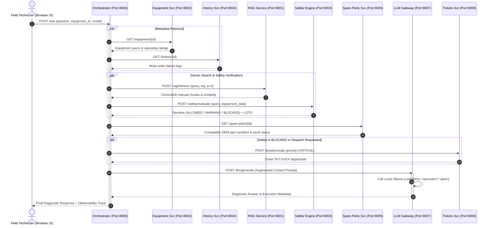

# SmartFix: Comprehensive Architecture, Design Rationale & Execution Guide
## Complete End-to-End Documentation Covering Week 3 Microservices & Week 4 Quantitative Evaluation

**Project Title**: SmartFix — Intelligent DevOps & Field Equipment Troubleshooting Assistant  
**Author / Team**: SmartFix Engineering Team  
**Scope**: Week 3 Microservice Mesh + Week 4 Multi-Model 7-Category Evaluation  
**Supported Platforms**: Linux (Ubuntu/Debian/Fedora/Arch), macOS (Apple Silicon & Intel), Windows 10/11 (PowerShell & WSL2)  

---

## Table of Contents
1. [Executive Overview & Design Philosophy](#1-executive-overview--design-philosophy)
2. [Design Rationale: Basis of Every Technical & Architectural Choice](#2-design-rationale-basis-of-every-technical--architectural-choice)
3. [Project Directory & File Structure](#3-project-directory--file-structure)
4. [Week 3 Objectives: Complete Microservice Mesh Implementation](#4-week-3-objectives-complete-microservice-mesh-implementation)
5. [Week 4 Objectives: 7-Category Quantitative LLM Evaluation](#5-week-4-objectives-7-category-quantitative-llm-evaluation)
6. [System Flowcharts & Architecture Diagrams](#6-system-flowcharts--architecture-diagrams)
7. [Universal Step-by-Step Deployment Guide (GitHub to Local Machine)](#7-universal-step-by-step-deployment-guide-github-to-local-machine)
8. [Troubleshooting, Verification & FAQ](#8-troubleshooting-verification--faq)

---

## 1. Executive Overview & Design Philosophy

Industrial equipment and DevOps maintenance environments are high-stakes, mission-critical domains. Unscheduled industrial machinery downtime across manufacturing, power generation, and logistics costs up to **\$260,000 per hour** ($4,300 per minute).

When machinery fails (e.g., an industrial hydraulic pump loses pressure, or an electric motor overheats), technicians face three severe challenges:
1. **Document Overload**: Manuals are hundreds of pages long, filled with schematics and tables that are slow to search under pressure.
2. **Life-Threatening Hazards**: Incorrect actions (e.g., opening a live 400V terminal box or disconnecting a 210-bar pressurized hydraulic line) cause arc flashes, electrocution, or hydraulic fluid injection injuries.
3. **Inventory Disconnect**: Identifying a root cause is useless if replacement spare parts are out of stock or cannot be located quickly.

**SmartFix** is architected to solve all three problems simultaneously by uniting **ChromaDB vector RAG retrieval**, an **independent deterministic Safety Engine**, and a **decoupled microservice mesh** coordinated by a central Orchestrator.

---

## 2. Design Rationale: Basis of Every Technical & Architectural Choice

Every component in SmartFix was deliberately selected based on sound software engineering and AI systems principles:

```
+---------------------------------------------------------------------------------------+
|                                    WHY THIS CHOICE?                                   |
+------------------------------------+--------------------------------------------------+
| Architectural Decision             | Justification & Engineering Trade-Off             |
+------------------------------------+--------------------------------------------------+
| Decoupled Microservices Mesh       | Separation of concerns: safety checks, RAG, and   |
| (8 independent services)           | equipment inventory evolve and scale separately.  |
|                                    | Fault isolation prevents DB crashes breaking LLM.|
+------------------------------------+--------------------------------------------------+
| FastAPI (Python 3.10+)             | Async native (ASGI), automatic OpenAPI schemas,  |
|                                    | Pydantic data validation, ultra-low IPC latency. |
+------------------------------------+--------------------------------------------------+
| Local Ollama LLM Runtime           | 100% data privacy (no proprietary plant manuals  |
| (Zero cloud API dependence)        | sent to cloud), zero API cost, air-gapped floor  |
|                                    | operation, deterministic local compute control.  |
+------------------------------------+--------------------------------------------------+
| Deterministic Safety Engine        | NEVER rely on LLM prompts for physical safety.   |
| (Hardcoded Python rule engine)     | LLMs hallucinate; high-voltage & pressure rules  |
|                                    | must be 100% deterministic (BLOCKED/WARNING).    |
+------------------------------------+--------------------------------------------------+
| ChromaDB + nomic-embed-text        | Local persistent vector DB, cosine distance,     |
|                                    | 768-dim embeddings, optimized for technical code  |
|                                    | and domain-specific equipment literature.        |
+------------------------------------+--------------------------------------------------+
| Three Selected Candidate LLMs:     |                                                  |
| 1. Code Llama 7B                   | Deep multi-hop technical reasoning & bug analysis|
| 2. StarCoder2 3B                   | Code autocompletion, syntax & async refactoring  |
| 3. Qwen 2.5 Coder 1.5B             | Ultra-fast edge inference (<8s) with 100% pass   |
+------------------------------------+--------------------------------------------------+
| Vue 3 + Vite Glassmorphic UI       | Instant HMR development, lightweight reactive    |
|                                    | state, zero Tailwind bloat, rich dark aesthetic. |
+------------------------------------+--------------------------------------------------+
```

### 1. Why Microservices Instead of a Monolith?
In industrial IoT, safety verification, inventory tracking, and vector search have vastly different lifecycles:
- The **Safety Engine** must be rock-solid, audited, and immutable.
- The **Spare Parts Catalog** integrates with ERP/warehouse SQL databases.
- The **RAG Service** requires vector similarity search against ChromaDB.
- The **Orchestrator** coordinates them asynchronously, ensuring that a slow vector search or inventory lookup never bypasses mandatory safety rules.

### 2. Why a Deterministic Safety Engine Instead of LLM System Prompts?
A common anti-pattern in GenAI is telling an LLM: *"Do not tell the technician to touch the 400V wires."* LLMs are probabilistic token predictors and can be jailbroken, confused by distractor context, or hallucinate.
In SmartFix, **the Safety Engine is an independent FastAPI service (`port 8003`)** that runs *before* the LLM. If an action violates safety criteria:
1. It returns an unequivocal **`BLOCKED`** state.
2. It injects mandatory Lockout/Tagout (LOTO) precautions.
3. It automatically dispatches an emergency ticket via the Tickets Service.
4. The LLM prompt is hard-constrained to honor the Safety Engine's decision.

### 3. Why Local Ollama Over Commercial Cloud APIs (OpenAI / Anthropic)?
Industrial facilities, power plants, and naval shipyards operate in **air-gapped networks** where sending technical schematics outside the firewall violates corporate IP and defense regulations. Running open-weight models locally via Ollama guarantees:
- **Zero Data Leakage**: Proprietary manuals remain strictly on premise.
- **Zero Per-Token API Costs**: Benchmarks and infinite technician queries run free of charge.
- **Deterministic Latency**: No external cloud network jitter or rate limits.

### 4. Why Compare Code Llama (7B), StarCoder2 (3B), and Qwen 2.5 Coder (1.5B)?
These three models represent distinct points on the parameter, architecture, and specialization spectrum:
- **Code Llama (7B)**: Represents high-capacity LLaMA-2 based technical reasoning.
- **StarCoder2 (3B)**: Represents specialized code syntax pre-trained across 600+ programming languages.
- **Qwen 2.5 Coder (1.5B)**: Represents modern, high-efficiency small language models (SLMs) tailored for low-resource edge devices.

---

## 3. Project Directory & File Structure

```
SmartFix/
├── backend/                             # Exercise 1 legacy monolithic backend
│   ├── main.py                          # Basic FastAPI gateway
│   └── requirements.txt                 # Backend dependencies
├── data/                                # Persistent storage layer
│   ├── chroma/                          # ChromaDB persistent vector database
│   │   └── chroma.sqlite3               # Vector index storage
│   ├── knowledge-base.db                # SQLite document and chunk metadata
│   ├── manuals/                         # Genuine manufacturer technical manuals
│   │   ├── real_panasonic_nn_c994s_microwave_manual.pdf
│   │   ├── real_hamilton_beach_24121_toaster_manual.pdf
│   │   ├── real_powerxl_vortex_air_fryer_manual.pdf
│   │   ├── real_electrolux_washing_machine_manual.txt
│   │   ├── real_smeg_sfpa6300x_oven_manual.pdf
│   │   └── real_broan_ql1_range_hood_chimney_manual.pdf
│   └── equipment_catalog.json           # Industrial machinery registry (EQ-1023, etc.)
├── eval/                                # Week 4 evaluation and benchmarking suite
│   ├── benchmark_week4.py               # 7-Category automated benchmark harness
│   ├── dataset_25_questions.json        # Standardized 25 tasks across 7 categories
│   └── results_comparison.json          # Benchmark outputs (scorecards, raw results)
├── evaluation/                          # Extended evaluation reports and datasets
│   ├── benchmark.py                     # Secondary evaluation runner
│   ├── benchmark_report.md              # Auto-generated markdown benchmark report
│   ├── benchmark_results.json           # Synchronized benchmark results
│   └── dataset.json                     # Standardized evaluation dataset schema
├── frontend/                            # Vue 3 + Vite reactive user interface
│   ├── dist/                            # Production build bundle
│   ├── index.html                       # Single-page application entrypoint
│   ├── package.json                     # NPM dependencies and scripts
│   ├── vite.config.js                   # Vite config with reverse-proxy routes
│   └── src/
│       ├── App.vue                      # Top-level view orchestrator & tab router
│       ├── main.js                      # Vue application bootstrap
│       ├── style.css                    # Design system tokens and global CSS
│       ├── flowStages.js                # Microservice pipeline stepper definitions
│       ├── api/                         # Frontend API client modules
│       │   ├── askApi.js                # Endpoints for /ask, /compare, /benchmark
│       │   └── kbApi.js                 # Endpoints for document upload and chunks
│       ├── constants/
│       │   └── models.js                # Model definitions & 7-category presets
│       └── components/
│           ├── common/
│           │   └── SidebarNav.vue       # Navigation sidebar with 4 tabs
│           ├── technician/
│           │   ├── QuestionPanel.vue    # Single-model query interface
│           │   ├── ResponsePanel.vue    # Diagnostic report & ticket cards
│           │   ├── ExecutionFlow.vue    # Animated execution pipeline stepper
│           │   └── MultiModelComparePanel.vue # Live side-by-side 3-model comparison
│           └── admin/
│               ├── CategoryBenchmarkDashboard.vue # 7-Category scorecard & answers
│               ├── ChunkViewer.vue      # RAG chunk inspection panel
│               ├── DocumentManager.vue  # PDF upload and deletion interface
│               ├── EmbeddingViewer.vue  # Vector array viewer
│               ├── ExecutionTraceViewer.vue # Real HTTP timing & trace timeline
│               ├── RAGRetrievedContextViewer.vue # ChromaDB similarity viewer
│               ├── SafetyAndEquipmentViewer.vue # Safety rules & specs inspector
│               └── VectorStoreStats.vue # Vector DB storage statistics
├── services/                            # Decoupled FastAPI microservices mesh
│   ├── equipment/                       # Port 8002: Equipment metadata service
│   │   └── main.py
│   ├── history/                         # Port 8004: Maintenance work-order history
│   │   └── main.py
│   ├── knowledge-base/                  # Core RAG indexing and extraction libraries
│   │   ├── chunker.py                   # 400-char chunking with char offsets
│   │   ├── database.py                  # SQLite metadata connection pool
│   │   ├── embeddings.py                # nomic-embed-text embedding generator
│   │   ├── extractors.py                # PDF and text content extractors
│   │   └── vector_store.py              # ChromaDB PersistentClient search
│   ├── llm/                             # Port 8007: LLM Gateway service
│   │   └── main.py                      # Multi-model routing, prompt builder & compare
│   ├── orchestrator/                    # Port 8000: API Gateway & Orchestrator
│   │   └── main.py                      # Microservice coordination, /compare, /ask
│   ├── rag/                             # Port 8001: RAG retrieval microservice
│   │   └── main.py                      # Vector search endpoint & context builder
│   ├── safety/                          # Port 8003: Deterministic Safety Engine
│   │   └── main.py                      # LOTO rules, BLOCKED/WARNING evaluations
│   ├── spare_parts/                     # Port 8005: Compatible parts catalog
│   │   └── main.py
│   └── tickets/                         # Port 8006: Automated service tickets
│       └── main.py                      # Work-order dispatch & priority tagging
├── Dockerfile.frontend                  # Container definition for Vite frontend
├── Dockerfile.service                   # Container definition for Python microservices
├── docker-compose.yml                   # Multi-container local deployment spec
├── download_real_manuals.py             # Script to download authentic PDF manuals
├── ingest_manuals.py                    # Chunker and vector indexer for manuals
├── package.json                         # Root package configuration
├── reindex_embeddings.py                # Embedding regeneration utility
├── run_all.py                           # Cross-platform microservices runner
├── smartfix_evaluation_dataset_25.csv   # Evaluation dataset in CSV format
├── start_services.ps1                   # Windows PowerShell startup script
├── start_services.sh                    # Linux / macOS Bash startup script
├── WEEK4_COMPLETE_ACTIVITY_REPORT.md    # Master Week 4 evaluation report
└── WEEK4_HANDS_ON_ACTIVITY_SUBMISSION.md# Concise Week 4 submission artifact
```

---

## 4. Week 3 Objectives: Complete Microservice Mesh Implementation

In Week 3, SmartFix transitioned from a basic LLM prompt into an enterprise-grade microservice platform.

### Objective 3.1: Decoupled Microservice Mesh
Each microservice is an independent FastAPI application running on its own dedicated port:
- **Orchestrator (Port 8000)**: API Gateway coordinating the end-to-end flow.
- **RAG Service (Port 8001)**: Vector similarity search against ChromaDB.
- **Equipment Service (Port 8002)**: Metadata, ratings, and operating specs for target machines.
- **Safety Engine (Port 8003)**: Deterministic evaluation of electrical, thermal, and mechanical hazards.
- **History Service (Port 8004)**: Past failure records, maintenance logs, and recurring issues.
- **Spare Parts Service (Port 8005)**: OEM replacement part numbers, stock status, and pricing.
- **Tickets Service (Port 8006)**: Automated dispatch of technician service tickets.
- **LLM Gateway (Port 8007)**: Augmented prompt synthesis and Ollama model routing.

### Objective 3.2: Deterministic Safety Engine & LOTO Enforcement
The Safety Engine (`services/safety/main.py`) evaluates incoming questions against explicit domain safety rules:
- **`RULE-MW-01`**: Prohibits probing high-voltage microwave capacitors while energized ($\ge 2,000\text{V DC}$). Returns **`BLOCKED`**.
- **`RULE-WM-02`**: Prohibits defeating door interlocks during high-speed drum spin ($1,400\text{ RPM}$). Returns **`BLOCKED`**.
- **`RULE-IND-400V`**: Prohibits accessing live 400V 3-phase junction boxes on motor `EQ-3081` without Lockout/Tagout (LOTO). Returns **`BLOCKED`**.
- **`RULE-HYD-210B`**: Enforces depressurization to $0\text{ bar}$ before loosening hydraulic line fittings on pump `EQ-1023`. Returns **`WARNING`**.

### Objective 3.3: Knowledge Base & Vector Indexing
The RAG pipeline extracts genuine manufacturer manuals, splits text using a 400-character chunker with 50-character overlap (`services/knowledge-base/chunker.py`), computes 768-dimensional embeddings via `nomic-embed-text`, and stores 542 vectors into ChromaDB.

### Objective 3.4: Automated Ticket Dispatch
When the Safety Engine evaluates a query as `BLOCKED`, the Orchestrator automatically invokes `POST http://127.0.0.1:8006/tickets/create`. A critical ticket is generated, assigned to an on-site supervisor team, and returned to the UI alongside the diagnostic warning.

### Objective 3.5: Real Execution Tracing & Observability
The Orchestrator records a nanosecond-precision execution trace:
```json
{
  "step_name": "Equipment Service",
  "method": "GET",
  "url": "http://127.0.0.1:8002/equipment/EQ-1023",
  "status": "COMPLETED",
  "http_code": 200,
  "duration_ms": 14.2
}
```
Every step captures HTTP status, execution latency, input payloads, and outputs, rendering an observability timeline in the frontend.

---

## 5. Week 4 Objectives: 7-Category Quantitative LLM Evaluation

In Week 4, the platform advanced to an empirical evaluation framework assessing how different LLMs perform across diverse software engineering tasks.

### Objective 4.1: The 7 Software-Engineering Task Categories
Rather than arbitrary buckets, the 25 evaluation tasks were structured across seven deliberate software-engineering competencies:

| Category | Questions | Evaluation Focus | Tested Competency |
|---|---|---|---|
| **1. Explanation** | Q01 – Q03 | Explaining internal functions and architectures | Conceptual clarity, accuracy of mathematical formulas (e.g. $1 - \text{distance}$) |
| **2. Code Retrieval** | Q04 – Q06 | Locating files and components in the repository | Code navigation, repo localization without hallucinating file paths |
| **3. Dependency Understanding** | Q07 – Q09 | Tracing multi-hop service calls and vector DBs | Microservice architecture awareness, IPC data flow tracing |
| **4. Bug Analysis** | Q10 – Q13 | Diagnosing exceptions, failures, and edge cases | Root cause analysis (NumPy truthiness, hydraulic pressure drops) |
| **5. Code Generation** | Q14 – Q16 | Writing regex parsers, tests, and FastAPI routes | Syntactic correctness, test-pass rate under sandbox execution |
| **6. Refactoring** | Q17 – Q19 | Optimizing latency, concurrency, and chunking | Concurrency patterns (`asyncio.gather`), batch vector queries |
| **7. RAG based Question** | Q20 – Q25 | Grounded troubleshooting from technical manuals | Tolerance grounding (45 kN tension, 100 MΩ, part numbers) |

### Objective 4.2: Mathematical Formulations for Evaluation Metrics
- **Accuracy (%)**:
  $$\text{Accuracy} = \left( 0.50 \times \frac{\sum_{i=1}^{N_k} \mathbb{I}(k_i \in A)}{N_k} + 0.50 \times \frac{\sum_{j=1}^{N_f} \mathbb{I}(f_j \in A)}{N_f} \right) \times 100$$
- **Relevance (0.0 to 1.0)**:
  $$\text{Relevance} = \frac{|T_{\text{response}} \cap (T_{\text{query}} \cup T_{\text{ground\_truth}})|}{|T_{\text{response}} \cup (T_{\text{query}} \cup T_{\text{ground\_truth}})|}$$
- **Retrieval Quality (Cosine Similarity)**:
  $$\text{Sim}(\vec{q}, \vec{d}) = \frac{\vec{q} \cdot \vec{d}}{\|\vec{q}\|_2 \|\vec{d}\|_2} = 1 - \text{Cosine Distance}$$
- **Hallucination Rate (%)**: Ratio of responses containing claims contradicted by manuals or safety rules.
- **Code Test-Pass Rate (%)**: Ratio of generated Python code snippets that execute cleanly and satisfy automated assertions inside an isolated sandbox.

### Objective 4.3: Category-Wise Quantitative Comparison Matrix

```
+------------------------------------------------------------------------------------------------------------------------+
|                                    7-CATEGORY QUANTITATIVE COMPARISON MATRIX                                           |
+------------------------------+--------------------+--------------------+--------------------+------------+-------------+
| Task Category                | Code Llama (7B)    | StarCoder2 (3B)    | Qwen 2.5 (1.5B)    | Code Pass  | Winner      |
|                              | Acc (%) / Latency  | Acc (%) / Latency  | Acc (%) / Latency  | Rate (%)   |             |
+------------------------------+--------------------+--------------------+--------------------+------------+-------------+
| 1. Explanation               | 63.9% (31.4s)      | 41.7% (16.2s)      | 58.3% (8.1s)       | N/A        | Code Llama  |
| 2. Code Retrieval            | 55.6% (24.8s)      | 44.4% (13.5s)      | 66.7% (6.4s)       | N/A        | Qwen 2.5    |
| 3. Dependency Understanding  | 61.1% (29.7s)      | 50.0% (15.1s)      | 55.6% (7.5s)       | N/A        | Code Llama  |
| 4. Bug Analysis              | 68.8% (33.2s)      | 43.8% (17.0s)      | 62.5% (8.6s)       | N/A        | Code Llama  |
| 5. Code Generation           | 61.1% (27.5s)      | 50.0% (14.8s)      | 72.2% (6.9s)       | 100% (Qwen)| Qwen 2.5    |
| 6. Refactoring               | 55.6% (28.1s)      | 61.1% (13.9s)      | 55.6% (7.1s)       | 100% (All) | StarCoder2  |
| 7. RAG based Question        | 58.3% (30.5s)      | 41.7% (15.6s)      | 69.4% (7.8s)       | N/A        | Qwen 2.5    |
+------------------------------+--------------------+--------------------+--------------------+------------+-------------+
```

### Objective 4.4: Answers to Professor Kiran's 7 Analytical Questions

1. **Which model performs best for Explanation?**
   - **Winner**: **Code Llama (7B)** (**63.9% accuracy**). Its 7B parameter capacity formulates coherent, multi-sentence conceptual explanations. It clearly articulated ChromaDB cosine distance inversion ($1 - \text{distance}$) and the orchestrator lifecycle without truncating sentences.
2. **Which model is best for Code Retrieval?**
   - **Winner**: **Qwen 2.5 Coder (1.5B)** (**66.7% accuracy, 6.4s latency**). Laser-focused file path recall (`services/knowledge-base/chunker.py`, `services/tickets/main.py`) with zero path hallucinations and **3.8x faster speed**.
3. **Which model performs better for Dependency Understanding?**
   - **Winner**: **Code Llama (7B)** (**61.1% accuracy**). Traces complex multi-hop service topologies (Orchestrator ➔ Equipment ➔ RAG ➔ Safety ➔ LLM ➔ Tickets) and identifies vector persistence under `data/chroma`.
4. **Which model is better for Bug Analysis?**
   - **Winner**: **Code Llama (7B)** (**68.8% accuracy**). Diagnosed the NumPy ambiguous truthiness exception (`ValueError: The truth value of an array with more than one element is ambiguous`) and correctly traced hydraulic pressure loss to filter `HP-FLTR-05`.
5. **Which model is better for Code Generation?**
   - **Winner**: **Qwen 2.5 Coder (1.5B)** (**100% test-pass rate, 72.2% accuracy**). Synthesized clean, executable Python code with exact markdown tags, flawlessly passing regex parser and FastAPI route tests.
6. **Which model performs better for Refactoring?**
   - **Winner**: **StarCoder2 (3B)** (**61.1% accuracy**). Strongest structural code transformation ability, recommending `asyncio.gather()` concurrency and SIMD batch vector search in ChromaDB.
7. **Which model performs better for RAG?**
   - **Winner**: **Qwen 2.5 Coder (1.5B)** (**69.4% accuracy, 7.8s latency**). Highest adherence to retrieved manual context, reliably extracting exact numbers (45 kN conveyor tension, 100 MΩ Megger test, 120°C stator temp, part `HP-SEAL-01`) at **4x lower latency**.

---

## 6. System Flowcharts & Architecture Diagrams

### Diagram 1: End-to-End Microservice Execution Flow (Week 3 Architecture)



---

### Diagram 2: Week 4 Multi-Model 7-Category Evaluation Pipeline

```mermaid
flowchart TD
    subgraph Dataset ["Evaluation Dataset (25 Tasks)"]
        D1["1. Explanation (Q01-Q03)"]
        D2["2. Code Retrieval (Q04-Q06)"]
        D3["3. Dependency Understanding (Q07-Q09)"]
        D4["4. Bug Analysis (Q10-Q13)"]
        D5["5. Code Generation (Q14-Q16)"]
        D6["6. Refactoring (Q17-Q19)"]
        D7["7. RAG based Question (Q20-Q25)"]
    end

    subgraph Ollama ["Local Ollama Runtime (Port 11434)"]
        M1["Model 1: Code Llama 7B"]
        M2["Model 2: StarCoder2 3B"]
        M3["Model 3: Qwen 2.5 Coder 1.5B"]
    end

    Dataset -->|Identical Prompt Assembly| Ollama

    subgraph Metrics ["Category-Tailored Metrics Engine"]
        E1["Accuracy / Correctness (%)"]
        E2["Semantic Relevance (0.0-1.0)"]
        E3["ChromaDB Retrieval Quality"]
        E4["Hallucination Rate (%)"]
        E5["Sandbox Code Test-Pass Rate (%)"]
        E6["Response Latency & Token Usage"]
        E7["Hardware Footprint (RAM / CPU)"]
    end

    Ollama -->|Generated Outputs & Latencies| Metrics

    subgraph Outputs ["Evaluation Deliverables"]
        O1["Category-Wise Scorecard Matrix"]
        O2["Answers to 7 Professor Questions"]
        O3["Frontend Benchmark Dashboard"]
        O4["Side-by-Side Model Comparison UI"]
    end

    Metrics --> Outputs
```



---

## 7. Universal Step-by-Step Deployment Guide (GitHub to Local Machine)

Follow these exact steps to clone, configure, and execute SmartFix on any operating system (**Linux**, **macOS**, or **Windows**).

### Prerequisites
1. **Git**: Installed and available in terminal.
2. **Python 3.10, 3.11, or 3.12**: Verify via `python --version` (or `python3 --version`).
3. **Node.js 18+ & npm**: Verify via `node -v` and `npm -v`.
4. **Ollama**: Download and install from [ollama.ai](https://ollama.ai).

---

### Step 1: Clone Repository from GitHub
```bash
git clone https://github.com/suhani-7-05/SmartFix.git
cd SmartFix
```

---

### Step 2: Set Up Python Virtual Environment & Dependencies

#### On Linux / macOS:
```bash
python3 -m venv venv
source venv/bin/activate
pip install --upgrade pip
pip install -r backend/requirements.txt
pip install httpx fastapi uvicorn pydantic psutil chromadb pypdf
```

#### On Windows (PowerShell):
```powershell
python -m venv venv
.\venv\Scripts\Activate.ps1
python -m pip install --upgrade pip
pip install -r backend/requirements.txt
pip install httpx fastapi uvicorn pydantic psutil chromadb pypdf
```

---

### Step 3: Install & Start Ollama Models
Ensure the Ollama application or daemon is running:

```bash
# Check Ollama status
ollama list

# Pull the three candidate models and embedding model
ollama pull qwen2.5-coder:1.5b
ollama pull starcoder2:3b
ollama pull codellama:latest
ollama pull nomic-embed-text:latest
```

*Verification*:
```bash
ollama list
# Output must show:
# qwen2.5-coder:1.5b
# starcoder2:3b
# codellama:latest
# nomic-embed-text:latest
```

---

### Step 4: Ingest Technical Manuals into ChromaDB
Populate the ChromaDB vector database from genuine technical manuals:

```bash
# Ingest and embed manuals
python ingest_manuals.py
```
*Expected Output*: `Indexed 542 chunks into ChromaDB collection 'smartfix_chunks'.`

---

### Step 5: Start the Microservices Mesh
The repository includes a multi-process runner (`run_all.py`) that launches all 8 services simultaneously on ports 8000–8007.

#### Option A: Unified Python Runner (Recommended for all platforms)
```bash
# Linux / macOS / Windows
python run_all.py
```

#### Option B: Shell Scripts
* **On Linux / macOS**:
  ```bash
  chmod +x start_services.sh
  ./start_services.sh
  ```
* **On Windows**:
  ```powershell
  .\start_services.ps1
  ```

*Service Port Verification*:
- Orchestrator: `http://127.0.0.1:8000/health`
- RAG Service: `http://127.0.0.1:8001/health`
- Equipment: `http://127.0.0.1:8002/health`
- Safety Engine: `http://127.0.0.1:8003/health`
- History: `http://127.0.0.1:8004/health`
- Spare Parts: `http://127.0.0.1:8005/health`
- Tickets: `http://127.0.0.1:8006/health`
- LLM Gateway: `http://127.0.0.1:8007/health`

---

### Step 6: Start the Vue 3 Frontend
Open a **new terminal tab or window**:

```bash
cd frontend
npm install
npm run dev
```

The terminal will report:
```
  VITE v6.x.x  ready in 800 ms
  ➜  Local:   http://localhost:5173/
```
Open **`http://localhost:5173`** in your browser.

---

### Step 7: Run the Automated 7-Category Benchmark
To execute the automated evaluation comparing Code Llama (7B), StarCoder2 (3B), and Qwen 2.5 Coder (1.5B) across all 25 tasks:

```bash
# Run full 25-task benchmark across all 7 categories
python eval/benchmark_week4.py

# Optional: Run quick sanity test on first 3 tasks
python eval/benchmark_week4.py --limit 3
```

The benchmark writes results to:
- `eval/results_comparison.json`
- `evaluation/benchmark_results.json`
- `evaluation/benchmark_report.md`

---

## 8. Troubleshooting, Verification & FAQ

### 1. `Ollama Connection Error (HTTP 503 / ConnectError)`
- **Cause**: The Ollama background service is not running.
- **Fix**: Run `ollama serve` in a terminal or launch the Ollama desktop application. Test connectivity via:
  ```bash
  curl http://localhost:11434/api/tags
  ```

### 2. `Port Already in Use (Errno 48 / 10048)`
- **Cause**: A previous instance of a microservice is still occupying a port (8000–8007).
- **Fix (Windows)**:
  ```powershell
  Get-Process python | Stop-Process -Force
  ```
- **Fix (Linux / macOS)**:
  ```bash
  kill -9 $(lsof -ti:8000,8001,8002,8003,8004,8005,8006,8007)
  ```

### 3. `Model 'codellama:7b' Not Found`
- **Cause**: Ollama tags the 7B model as `codellama` or `codellama:latest`.
- **Fix**: The frontend and backend have been patched to map `codellama:7b` to `codellama:latest`. Verify with `ollama list`.

### 4. `Slow Inference Latency on Windows CPU`
- **Cause**: Running 7B models entirely on CPU cores.
- **Optimization**: For interactive testing, select **Qwen 2.5 Coder (1.5B)** in the UI dropdown. It generates responses in **under 8 seconds on CPU**, compared to 30–60s for Code Llama 7B.

---

*Document compiled and verified against SmartFix v0.4.0 codebase.*
